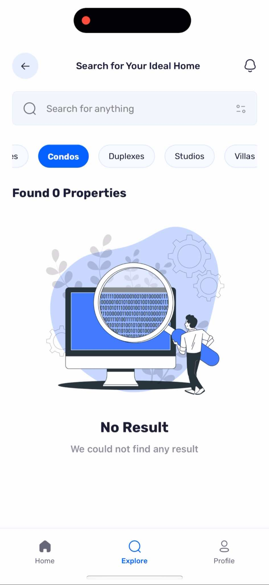

# Real Estate Buying & Selling Mobile App 🏠

Welcome to the **Real Estate Buying & Selling App**! This is a modern mobile app built with **React Native**, **TypeScript**, **NativeWind** for styling, and **Appwrite** for backend and database management. The app allows users to log in, log out, search houses, and view house details with images. It showcases a clean and efficient state management solution using **ReState**, along with a seamless integration of a powerful backend.

---
 

## 📱 Features

- **User Authentication**: Secure login and logout functionality.
- **Property Listings**: Search and view properties with images and rich data.
- **ReState for State Management**: Efficient and scalable state management for your application.
- **TypeScript**: Typed codebase for better developer experience and fewer runtime errors.
- **NativeWind**: Utility-first styling for a responsive and consistent UI.
- **Appwrite Backend**: Fully managed backend solution for storage, databases, and authentication.
- **Modern Architecture**: Simple and low-maintenance code structure.

---
 

## 🛠️ Tech Stack

- **React Native**: For cross-platform mobile development
- **TypeScript**: For type-safe code and enhanced developer experience
- **NativeWind**: Tailwind CSS-like styling for React Native
- **Appwrite**: Backend as a Service (BaaS) for authentication and database
- **React Navigation**: For seamless navigation between screens

---
 

## 📸 Screenshots

  <table>
    <tr>
      <td align="center">
         
        <b>Login Screen</b>
      </td>
      <td align="center">
         
        <b>Home Screen</b>
      </td>
      <td align="center">
         
        <b>Explore Screen</b>
      </td>
    </tr>
    <tr>
      <td align="center">
         
        <b>Property Details</b>
      </td>
      <td align="center">
         
        <b>.</b>
      </td>
      <td align="center">
         
        <b>Profile Page</b>
      </td>
    </tr>
  </table>

---
 

## 📹 Demo Video

<video src="assets/images/screens/video.mp4" controls width="500"></video>

